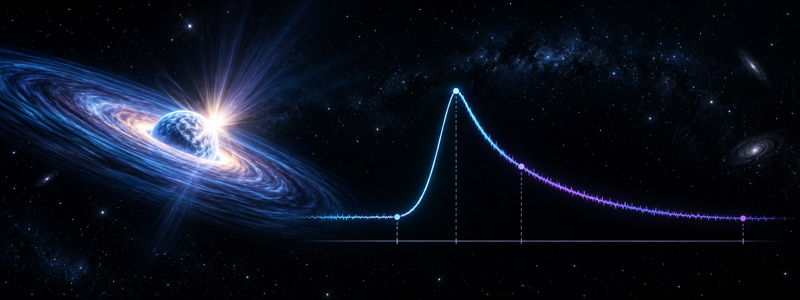
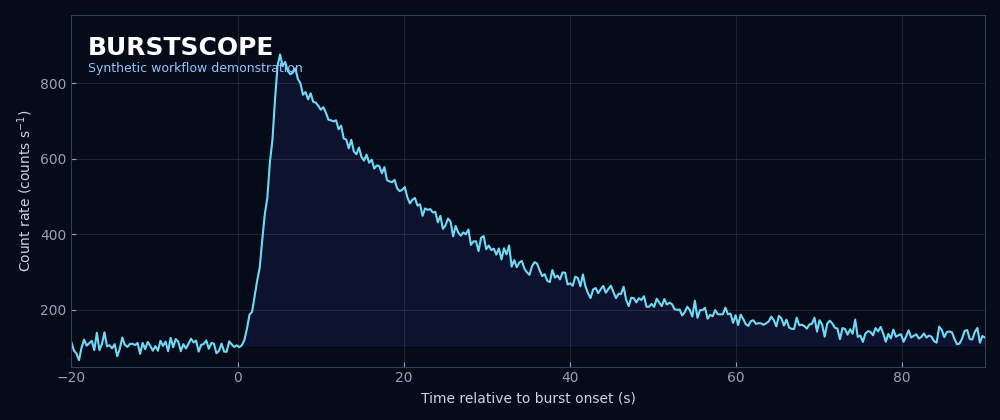

<p align="center">
  
</p>

# BurstScope

### Interactive thermonuclear X-ray burst characterisation

[](https://github.com/varunastronomy/burstscope-xray-characterisation/actions/workflows/quality-checks.yml)
[](https://www.python.org/)
[](https://fits.gsfc.nasa.gov/)

An interactive Python workflow for identifying timing landmarks in an X-ray burst light curve and exporting the selected burst interval as a Good Time Interval (GTI).

This repository is built around a research script developed and tested by **M. Varun** for observational X-ray astronomy. It combines manual interval selection with a transparent threshold-based method so that every reported landmark can be inspected directly against the light curve.

> **Scientific scope:** This program measures burst timing landmarks from a user-selected light-curve interval. It does not classify the physical origin of a transient, replace mission-specific calibration, or perform time-resolved spectroscopy.

## **Copyright, permission, and mandatory citation**

> **COPYRIGHT © 2026 M. VARUN, CHRIST (DEEMED TO BE UNIVERSITY), BENGALURU (BANGALORE), INDIA. ALL RIGHTS RESERVED.**
>
> **THIS REPOSITORY IS PUBLICLY VISIBLE FOR SCIENTIFIC AND PROFESSIONAL REVIEW, BUT NO PERMISSION IS GRANTED TO USE, COPY, MODIFY, REDISTRIBUTE, REPUBLISH, OR INCORPORATE THIS SOFTWARE INTO ANOTHER PROJECT WITHOUT PRIOR WRITTEN PERMISSION FROM THE AUTHOR.**
>
> **WHEN WRITTEN PERMISSION IS GRANTED, ANY SCIENTIFIC, ACADEMIC, EDUCATIONAL, OR COMMERCIAL USE MUST PROVIDE CLEAR ATTRIBUTION AND CITE M. VARUN AND THIS REPOSITORY.**

Required citation for approved use:

> M. Varun (2026), *BurstScope: Interactive Thermonuclear X-ray Burst Characterisation*, CHRIST (Deemed to be University), Bengaluru, India. GitHub repository: https://github.com/varunastronomy/burstscope-xray-characterisation

Public availability and GitHub forking do not constitute permission for reuse beyond the rights provided by GitHub's platform terms and applicable law.

## What the program does

- Reads a FITS light curve containing `TIME`, `RATE`, and `ERROR` columns.
- Displays the complete light curve for interactive interval selection.
- Retains user-selected pre-burst, burst, and post-burst data.
- Identifies the burst start, peak, maximum, e-folding point, and end using explicit criteria.
- Calculates the rise time and post-maximum e-folding time.
- Searches for an earlier candidate onset that may precede the principal rise.
- Saves numerical results, an annotated plot, a text GTI, and a FITS GTI.

## Workflow preview

<p align="center">
  
</p>

The animation is a **synthetic demonstration** created only to explain the workflow. It is not an observational result and is not used to validate the scientific method.

## Scientific method at a glance

The method operates on the observed count rate; it does not subtract the persistent level before applying the fractional thresholds.

| Quantity | Operational definition |
|---|---|
| Principal start candidate | First bin after the last pre-maximum bin below 25% of the observed maximum |
| Earlier-onset search | Up to 15 s before the principal candidate |
| Earlier-onset criteria | At least background + 3.5 standard deviations and at least 10% of the observed maximum |
| Peak time | First pre-maximum bin reaching 90% of the observed maximum |
| Maximum time | Time of the highest selected count rate |
| E-folding point | First post-maximum bin at or below maximum divided by e |
| End | One bin after the first post-maximum bin at or below 25% of the observed maximum |

The background mean and standard deviation are estimated from the first 100 bins of the input light curve. These definitions are operational analysis choices and should not be interpreted as universal physical definitions. See [Scientific method](docs/SCIENTIFIC_METHOD.md) for the full boundary conditions.

## Quick start

```bash
git clone https://github.com/varunastronomy/burstscope-xray-characterisation.git
cd burstscope-xray-characterisation
python3 -m venv .venv
source .venv/bin/activate
python -m pip install -r requirements.txt
python Final_burst_characteristics.py
```

Enter the light-curve path, then drag horizontally across the upper panel to select an interval containing representative pre-burst emission, the complete burst, and post-burst emission. Close the plot window to continue the calculation.

## Input requirements

The program expects an OGIP-style FITS light curve with:

- a binary-table extension at HDU 1;
- `TIME`, `RATE`, and `ERROR` columns in HDU 1;
- `TIMEZERO` in the HDU 1 header, or zero if the keyword is absent; and
- a GTI-compatible header in HDU 2.

Mission products should be calibrated and screened with the appropriate mission software before using this program.

## Outputs

| Output | Purpose |
|---|---|
| `Burst_characteristics.txt` | Measured landmark times, rates, and timescales |
| `Burst_characteristics.png` | Annotated burst light curve |
| `Burst_gti` | Tab-separated absolute GTI start and stop times |
| `Burst_gti.fits` | FITS GTI extension using the input GTI header metadata |

Generated products are ignored by Git so that observational results are not accidentally committed.

## Repository contents

```text
.
├── assets/                         # Banner and synthetic workflow preview
├── Final_burst_characteristics.py  # Scientific analysis program
├── docs/
│   ├── SCIENTIFIC_METHOD.md        # Definitions, assumptions, and limitations
│   └── USAGE.md                    # Installation and operating guide
├── CITATION.cff                    # Citation metadata
├── CONTRIBUTING.md                 # Contribution and review expectations
└── requirements.txt                # Python dependencies
```

## Validation status

- The Python source is syntax-checked in continuous integration.
- The repository structure and dependency declarations are checked statically.
- Scientific runtime validation requires a suitable FITS light curve and an interactive graphical environment; no observational data are distributed here.

## Skills demonstrated

This project provides evidence of practical experience with Python, FITS data, interactive scientific visualisation, array and tabular analysis, reproducible environments, GTI generation, scientific documentation, and cautious interpretation of model-dependent analysis choices.

## Citation and reuse

Citation metadata are provided in [`CITATION.cff`](CITATION.cff). No software license has been assigned. Copyright remains with the author, reuse rights have not been granted, and citation does not replace the requirement to obtain prior written permission.

## Author

**M. Varun**<br>
X-ray astronomy researcher and scientific Python developer<br>
CHRIST (Deemed to be University), Bengaluru (Bangalore), India<br>
[GitHub: varunastronomy](https://github.com/varunastronomy)
